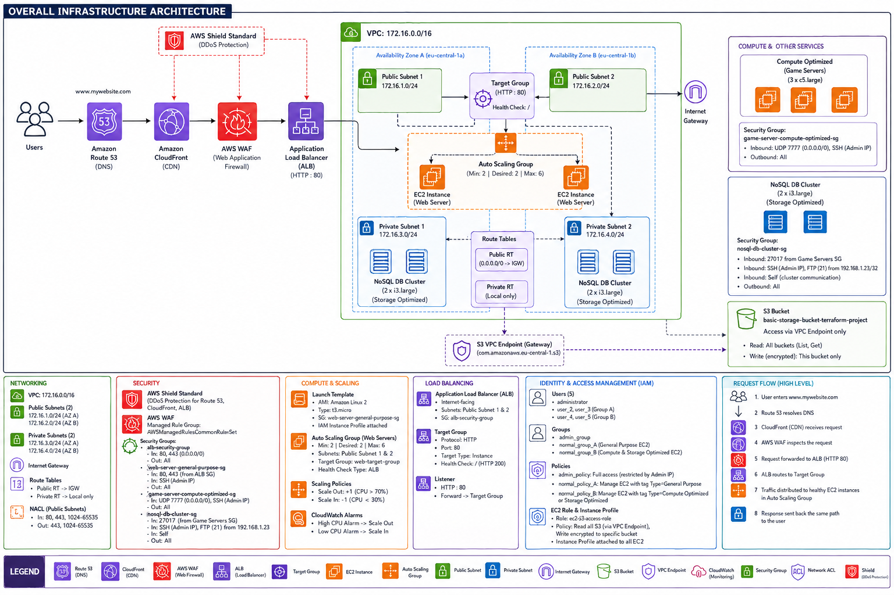

# AWS Infrastructure Project (Terraform)

This repository contains Terraform configurations to deploy a highly available, secure, and scalable cloud infrastructure on AWS. It includes a web application layer with global CDN delivery, Web Application Firewall (WAF) protection, DNS management, and private database subnets.

---

# Architecture Overview

What does this project build?

-> **DNS & Routing (Route 53):** Managed DNS Hosted Zone with custom Alias records for seamless domain mapping.

-> **Global Content Delivery (CloudFront):** Edge-cached Content Delivery Network (CDN) enforcing HTTPS-only traffic to speed up response times globally.

-> **Security & Protection (WAFv2):** Regional Web Application Firewall associated with the Application Load Balancer to mitigate OWASP Top 10 vulnerabilities (using AWS Managed Rules).

-> **Traffic Distribution:** Application Load Balancer (ALB) to route incoming application traffic safely to backend resources.

-> **VPC Network:** Dual-zone architecture split into public subnets (for edge/web traffic) and private subnets (for databases).

-> **Compute & Database:** Auto Scaling Group for web application servers along with dedicated EC2 instances for gaming and NoSQL workloads.

-> **Identity & Access Management:** IAM roles, user policies, and secure bucket access for S3 storage.

---

# Requirements

* [Terraform](https://developer.hashicorp.com/terraform/downloads) (v1.2 or newer)
* [AWS CLI](https://aws.amazon.com/cli/) configured with proper credentials
* [LocalStack](https://www.localstack.cloud/) *(optional, for local testing without AWS cost)*

---

# Quick Start:
_-_-_ bash/powershell

* terraform init
* terraform apply

check infra:
* terraform state list
* terraform show

destroy infra:
* terraform destroy

code validation:
* terraform validate